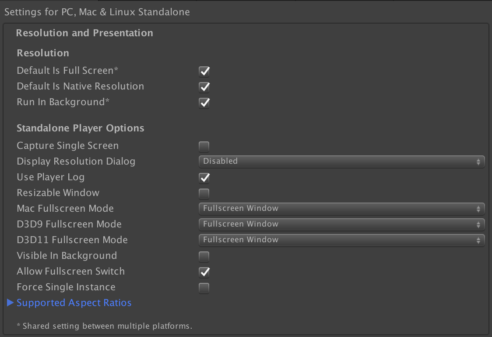
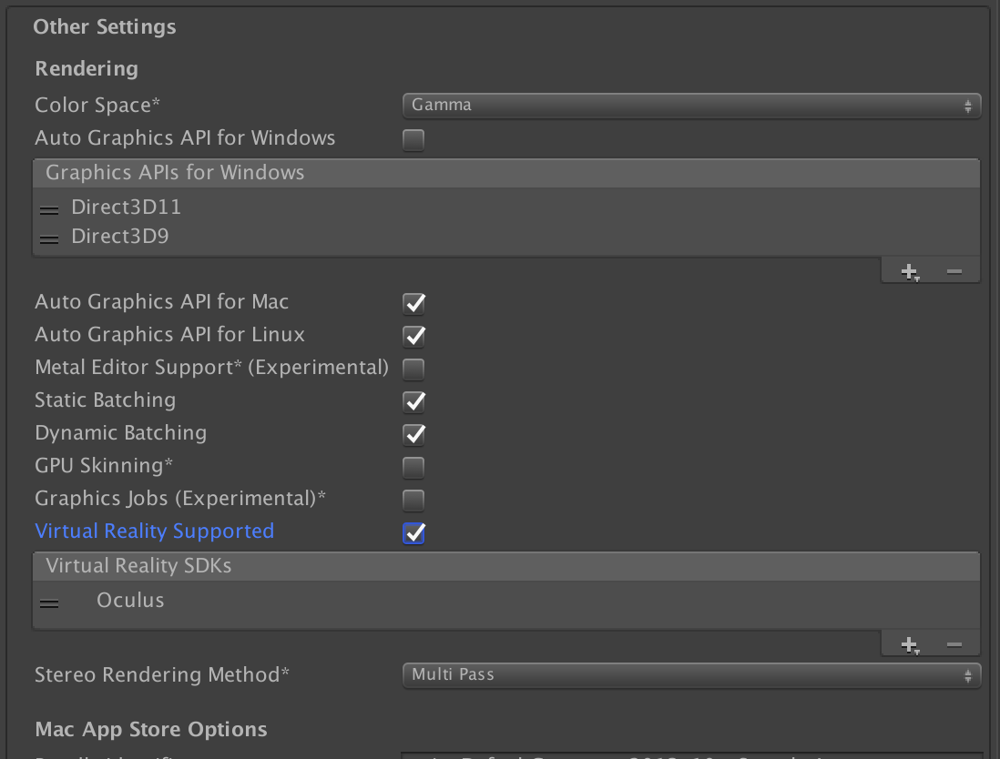

# vr-up-forever
This is an article with tips about how to keep a VR installation up forever

This doc is a work in progress and I'll continue to add new things as they come up. If you have questions feel free to tweet me [@L4Z3RC47](https://twitter.com/L4Z3RC47)

Inspired by Installation_Up_4evr by [laserpilot](https://github.com/laserpilot)

## Table of Contents
1. [Introduction](#introduction)
1. [Building a computer](#building-a-computer)
    * [Oculus minimum specs](#oculus-minimum-specs)
    * [HTC minimum specs](#htc-minimum-specs)
1. [Setting up your computer](#setting-up-your-computer)
    * [Rack 'em up](#rack'em-up)
        * [Configure the OS](#configure-the-os)
    * [Lock it down](#lock-it-down)
        * [Not free but easy](#not-free-but-easy)
        * [Free and minimal](#free-and-minimal)
        * [The hard way](#windows-embedded)
1. [Setting up your software](#setting-up-your-software)
    * [Unity 3D apps](#unity-3d-apps)
        * [Installation with a mirrored monitor](#installation-with-a-mirrored-monitor)
            * [Configuring an attract screen](#configuring-an-attract-screen)
    * [Unreal Engine apps](#unreal-engine-apps)
    * [Oculus Rift](#oculus-rift)
    * [HTC Vive](#htc-vive)
1. [Guiding your users](#guiding-your-users)
    * [Creating controller tutorials](#creating-controller-tutorials)
1. [Safety](#safety)
1. [Hardware Considerations](#hardware-considerations)
    * [Oculus](#oculus)
    * [Vive](#vive)
1. [Useful Links](#useful-links)
    * [Software](#software)
    * [Hardware](#hardware)
    * [Code examples](#code-examples)
1. [Contributing](#contributing)

## Introduction

This document is intended to serve as a general guide for setting up unattended VR installations. There are many different possible configurations depending on your needs. A lot of this doc is compiled from my experience setting up installations for [DiMoDA](https://dimoda.art). If you have suggestions please feel to submit contributions!

As of this writing most VR installations are confined to the PC realm so this guide is going to stay focused on Windows configuration for now. It would be great to get a linux section started too. Currently Apple hardware does not officially support the major VR hardware. If Apples hardware gets updated and drivers are made for macOS I'll update this guide to include configurations for those machines as well.

## Building a computer

There are now many different options available when looking for VR compatible machines, including laptops from manufacturers such as MSI and Asus. That being said, I prefer to build my own machines. There's a certain level of comfort when installing a computer that I've built where I know exactly what all of the components are, and exactly what software is installed. Not to say that off the shelf computers are less reliable, its just my personal preference. When building your own machine its also likely that you'll be able to save a bit of money, and if you've never built a computer before you'll learn a lot in the process :)

Building a PC is often a balance between performance and cost of components. Currently my preferred specs are:

* CPU: Intel i7 6700K Skylake 4Ghz
* GPU: MSI GTX 1070 Founder Edition
* RAM: 16GB G.Skill Ripjaws V Series DDR4 2400
* Memory: Samsung 850 EVO 120GB SSD
* Motherboard: Asus Maximus Gene VIII (mATX) LGA 1151
* PSU: CORSAIR RM750X
* Wireless card (optional): TP-LINK TL-WDN4800 Wireless N900 PCI Express Adapter.
* Case: Bitfenix Prodigy Micro ATX
* CPU Fan: CORSAIR Hydro Series H50 120mm CPU Cooler
* OS: Windows 10 (64)

Both Oculus and HTC also provide their own minimum supported specs. If your installation is minimal you should be able to get by but if possible its always best to test if on the hardware you're planning on using before buying if possible.

#### Oculus minimum specs

* CPU: Intel i3-6100 / AMD FX4350 or greater
* GPU: Nvidia 960 / AMD 290 or greater : Compatible HDMI 1.3 video output
* RAM: 8GB+
* 1x USB 3.0, 2x USB 2.0
* OS: Windows 8 or newer

Oculus also has a page listing 'Oculus ready PCs' [here](https://www.oculus.com/oculus-ready-pcs/).

#### HTC minimum specs

* CPU: Intel™ Core™ i5-4590 or AMD FX™ 8350, equivalent or better
* GPU: NVIDIA GeForce™ GTX 1060 or AMD Radeon™ RX 480, equivalent or better : Video output: 1x HDMI 1.4 port, or DisplayPort 1.2 or newer
* RAM: 4 GB or more
* USB: 1x USB 2.0 port or newer
* OS: Windows™ 7 SP1, Windows™ 8.1 or later or Windows™ 10

HTC also posts their current minimum specs and links to some hardware [here](https://www.vive.com/us/ready/).

## Setting up your computer

### Rack'em up

#### Configure the OS

1. Configure your BIOS. If available change the power settings to turn the computer on after a power failure. For the extra security conscious depending on your motherboard and BIOS firmware you may also be able to disable any unused USB ports. If your computer is exposed this can help prevent any unwanted meddling.

1. Install all your drivers (graphics card, audio card, wireless drivers etc...)

1. If your using a Rift install the [Oculus app](https://www3.oculus.com/en-us/setup/) and go through the device setup sequence.

1. Setup a new local standard user account, install your app for that (or both new and admin) user/s. In your standard user account test launching both your app and the Oculus Home app. Oculus home is setup per user so you will need to run all of your Oculus setup on this user account too.

1. If your computer will be somewhere accessible by visitors you may want to disable the power button in the in System Settings/Hardware and Sound/Power Options/

1. Configure any additional sound output to mirror the Oculus headset output

1. Create a .bat file to launch Oculus home, your app, and any other apps your installation is dependent on. Add the .bat script to your Startup folder for the standard user account you just created. We start with launching the Oculus home app first as the Oculus rift is dependent on the app. By starting this first we prevent the Home app from starting after the launch of our application which would result in the Home app being displayed with a focus on top of our app.


	```dos
	@ECHO OFF
	TIMEOUT /T 10
	REM Total Delay = 10 seconds
	Start "" "C:\<PATH TO "OculusClient.exe" OR ALIAS>"
	TIMEOUT /T 30
	REM Total Delay = 30 seconds
	Start "" "C:\<PATH TO YOUR APP OR ALIAS>"
	```

1. Setup a power schedule if needed. To set a startup time you may need to return to your BIOS settings. To set a Shutdown time you can follow [these instructions](https://www.nextofwindows.com/how-to-schedule-windows-automatically-power-on-and-power-off) on how to setup a scheduled task in the control panel.

1. Setup your computer to automatically login to your standard account.

    1. Click Start, type netplwiz, and then press Enter.
    1. In the User Accounts dialog box, click the account you want to automatically log on to.If it is available, clear the Users Must Enter A User Name And Password To Use This Computer check box.
    1. Click OK.
    1. In the Automatically Log On dialog box, enter the user’s password twice and click OK.

    Referenced from https://technet.microsoft.com/en-us/library/ee872306.aspx

1. Test test test your app and make sure everything is running smoothly.

### Lock it down

#### Not free but easy

Inteset offers an interesting piece of software called [Secure Lockdown](http://www.inteset.com/secure-lockdown-standard-edition.html). Basically this application lets you specify a single application or applications that are allowed to run on the machine. Once enabled the computer reboots into an ultra locked down mode which can only be exited via a special key combination and a passcode. This method seems to work well and also offers solutions for ensuring that your application is always activated and kept on top. See the [Secure Lockdown Users Guide](https://services.inteset.com/DownloadFiles/Inteset%20Secure%20Lockdown%20v2%20User%20Guide.pdf) for full documentation on how to get started. The app sells for $20.

After configuring your standard user account and setting up automatic login, go to your standard user account and configure Secure Lockdown from there. After enabling Secure Lockdown you should be prompted to restart your computer. On restart your computer should automatically login to your standard user and Secure Lockdown will mange launching and monitoring your VR app and any other processes.

#### Free and minimal

After configuring your computer and testing your application as long as your app is set to full screen on startup you should be ready to go!

Note: By only configuring basic startup you're potentially leaving your machine open to unwanted fiddling. Unless your computer is only accessible by trusted persons I would recommend going with the Secure Lockdown method above.

#### The hard way (Windows Embedded)

Coming Soon!
<br>
More for industry or enterprise installations I'll be working on adding step by step instructions for configuring a Windows embedded solution soon.

## Setting up your software

#### Unity 3D apps

There are several different settings and configurations that you can setup when compiling your application. For the purposes of this documentation I will cover basic configurations for the two most common types of installation, one with a monitor mirroring the content on the headset and a 'headless' installation with just the VR headset.

##### Basic Setup

1. Download and import the [Oculus Utilites for Unity](https://developer.oculus.com/downloads/package/oculus-utilities-for-unity-5/)

  You don't necessarily need to use any of these tools but they will come in handy later down the line. Additionally if you want to host your app on the Oculus store then you'll need to use Oculus' utilities to verify your application on launch.

1. In the player settings in your Unity project under 'Resolution and Presentation' set 'Display Resolution Dialog' to 'Disabled'. This prevents the resolution dialog from popping up when you start your application on launch which can get in the way when trying to automate your startup and shutdown of an installation.

    

    Then in 'Other settings' make sure that the 'Virtual Reality Supported' box is checked.

    

##### Installation with a mirrored monitor

Generally I prefer to run installations with a monitor for several reasons. First, this makes setup and configuration a lot easier. It can be very difficult to next to impossible to troubleshoot issues if you only have a VR headset as a display. If you're physically with the machine its also much quicker to interface with the machine directly if you can rather than relying on Remote Desktop or a VNC like solution. Additionally I find that having a monitor makes your users experience a bit more social so that other users/visitors can watch alongside as the person in the headset goes through the VR experience.

###### Handling headset removed

Most likely you'll want to trigger some event or switch scenes based on whether someone is wearing your headset or not. You can easily manage these events with the OVRManager which is a part of the Oculus Utilities package. Its best not to modify these scripts so instead we'll setup a delegate to handle the calls in our own script.

You'll need to attach an OVRManager script to one object in your scene. You can only have one OVRManager in a scene. Its best to attach this object to something that will not get destroyed when you load another scene.

```C#
using UnityEngine;

// Uncomment if you want to switch scenes based on the headset status.
// using UnityEngine.SceneManagement;

public class OVRHeadsetDelegate : MonoBehaviour {


	void OnEnable () {

		OVRManager.HMDMounted += HandleHMDMounted;
		OVRManager.HMDUnmounted += HandleHMDUnmounted;

	}

	void OnDisable () {

		OVRManager.HMDMounted -= HandleHMDMounted;
		OVRManager.HMDUnmounted -= HandleHMDUnmounted;

	}

	void HandleHMDMounted() {

		Debug.Log("HMD Mounted");

    // Trigger something here

	}

	void HandleHMDUnmounted() {

		Debug.Log("HMD UnMounted");

    // Trigger something here

	}
}
```

###### Configuring an attract screen

By default rendering will stop and you'll get either a paused game screen or just black on your external monitor when the headset is not mounted (on someone's head). To get around this you'll need to modify the OVRManager script to allow for running in the background. To do this find the 'runInBackground' bool and set it's value to 'true'

``` C#
internal static bool runInBackground = true;
```
Now when you run your app when the headset is removed the Oculus headset will turn off its display but your external monitor will continue running! From there you can use the OVRHeadsetDelegate script from above to manage loading a scene with a video or a slideshow to use as an attract screen for your experience.

**Tip!** <br>
When transitioning between scenes I find that its less jarring for your players/users/visitors to first fade out. Oculus provides a fading utility as a part of the Oculus Utilities that you can use but it must be modified to enable fading both in and out. I've uploaded my implementation of this script [here](https://github.com/wjrro/handy-oculus-scripts). Using this script you can trigger a fade and then use the fade time to delay triggering your scene change.

##### Headless installation

In my opinion the easiest way to configure a headless installation is to setup and test your .bat script startup or Secure Lockdown configuration first. Once you have everything starting automatically in the right order you should be able to unplug your monitor and run your application. Remember to restart your computer after unplugging your monitor.

Don't forget to test, test, test!

#### Unreal Engine apps

More info coming soon!

#### Oculus Rift

Currently when running an Oculus application you must also run the Oculus home application. When launching your app this unfortunately means that often times Oculus home will open and take focus on your main display if you are using one to mirror content outside of the headset. To get around this we setup a simple batch script to ensure that we launch Oculus home first, followed by our application.

#### HTC Vive

More info coming soon!

## Guiding your users

This part is less about making your installation run forever and more about creating a good experience that everyone can enjoy. Providing clear guidance to your users will often make the difference between a fun and engaging experience vs. a confusing and frustrating one. Include clear instructions for your audience up front and they will thank you for it (or at least they won't complain!) This is especially important when you don't have docents or assistants on hand to tell people how to interact with your app. For DiMoDA we try to include instructions in three places...

#### In print

Sometimes the easiest thing to do is to provide a diagram of your controls either as a print out or as wall text next to the place where your headset and controls normally rest.


#### In the attract screen

Similar to printed instructions if you already have a diagram and attract screen setup it can be a helpful aid for quickly familiarizing people with your controls

#### At the start of your experience

In a public installation its inevitable that some people are not going to be familiar with your controller any they may have a hard time getting used to a new device in a short period of time. This may also be their first experience with VR which adds another layer of unfamiliarity. Add onto all of this, if you're using an XBox One or PS4 controller your users will be unable to see their hands to help them get situated. Fortunately while they're wearing a headset you have complete control over the experience and there are a few things that you can do to help on-board people relatively quickly.

###### Show your control diagram

If you have one, right at the beginning of the experience is a good opportunity to show your display diagram. You can at least guarantee that the user will see it. If nothing else this should be a bare minimum. If it's not disruptive to your experience you may opt to display your diagram frequently as a reminder, for example when transitioning between scenes.

###### Provide controller tutorials

This option requires a bit more coding work but I think that it pays off and in the end is the most successful method of getting people familiar with controls quickly. There are many different ways to approach controls training so I'll share my approach in the section below. If other people come up with other methods they would like to share I will include them as sections in this doc as well.

#### Creating controller tutorials

###### XBox One Controller


###### Oculus Touch Controller


###### Vive Controller


## Safety

As with any installation, the safety of your visitors should be a top concern. If your experience is room scale and not seated I highly recommend marking out a boarder on the floor which mirrors the available roaming space for whoever is wearing the headset. This will help visitors who are observing keep clear of any sudden unpredictable movements made by the user. Taking advantage of the built in [Guardian System](https://support.oculus.com/help/oculus/1444824335542717) is a good idea. This system allows you to trace the 'safe' area for your user. With this enabled when the headset wearer gets close to the defined edge of 'play space' a visible wall will appear alerting the wearer of their proximity. Please note that if your sensor camera gets moved for any reason this can throw off the Guardian System's tracking and make the heads up boarder ineffective.

**Important**<br>
Some people can become disoriented when immersed in a VR experience. Because of this it is possible for someone to lose their balance and fall. For this reason I cannot recommend hosting an unattended standing experience.

For more information please see the [Oculus Health and Safety Warnings documents](https://www.oculus.com/legal/health-and-safety-warnings/).

**Hygiene**<br>
When you've got something that's going to be touching the faces of hundreds or thousands of people its important to keep things sanitary. You can find various face protector solutions available online but at a minimum you should provide alcohol free sanitary wipes in an accessible area to allow visitors the opportunity to clean things off. Its also probably a good idea to keep a microfiber cloth handy to give the lenses a cleaning now and then as well. Be careful not to clean the lenses with anything abrasive otherwise you risk scratching and permanently damaging the headset.

## Hardware Considerations

#### Oculus

The headset itself is lightweight and for the most part easy for people to adjust. That being said it is common for people to not notice the straps on the side of the headset that allow them to adjust the fit. If your installation will be left unattended I recommend putting a guide to adjusting the headset in print, upfront and next to the normal resting place of the headset and any controllers that you have.

Remind your users that parts of the headset are delicate! In particular the earphones are vulnerable to being damaged or completely ripped off. If you're not careful the HDMI/USB tether cable for the oculus can degrade overtime and you may run into connectivity issues if the cable becomes pinched or excessively bent in any areas. I recommend looking into solutions for providing extra support or reinforcement for your cables. Otherwise you may want to invest in a few spares. Fortunately Oculus now offers replacement parts for these components which may be purchased from the Oculus [accessories page](https://www.oculus.com/accessories/)


#### Vive


## Useful Links


#### Software


#### Hardware

* [Xbox One Controller Tether](https://www.lockdownmycontroller.com/collections/lockdown-anti-theft-hardware-for-xbox-one/products/xbox-one-controller-anti-theft-system-permanent-installation) This security tether is a minimal security case and does a decent job of securing the USB cable to the controller so it does't fall out. To prevent users from pressing the 'home' button which will trigger the Oculus home app we were able to epoxy a small piece of metal to the inside of the case over the button.


#### Code Examples


## Contributing

If you'd like to contribute to this project, please fork
the repository and make your changes in a separate branch.

```bash
git clone https://github.com/wjrro/vr-up-forever.git .
cd aic-project
git flow start feature yourinitials-good-description-issuenumberifapplicable
# Make some changes, commit your code
git push origin yourinitials-good-description-issuenumberifapplicable
```

Then on github.com, create a Pull Request to merge your changes into the
`master` branch.
